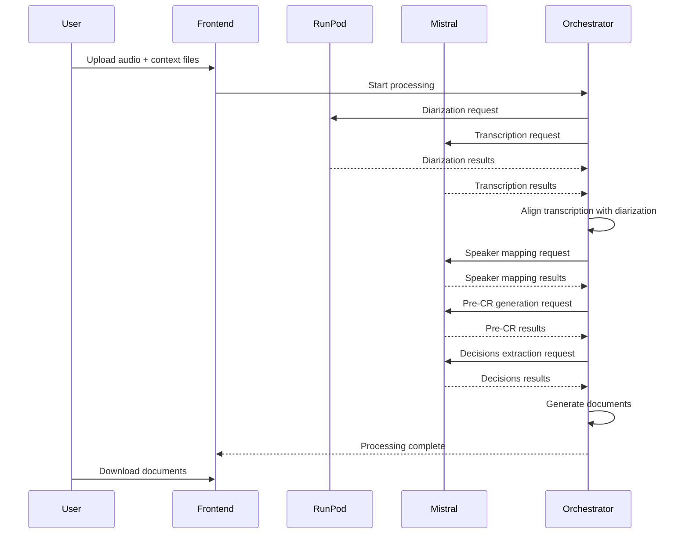
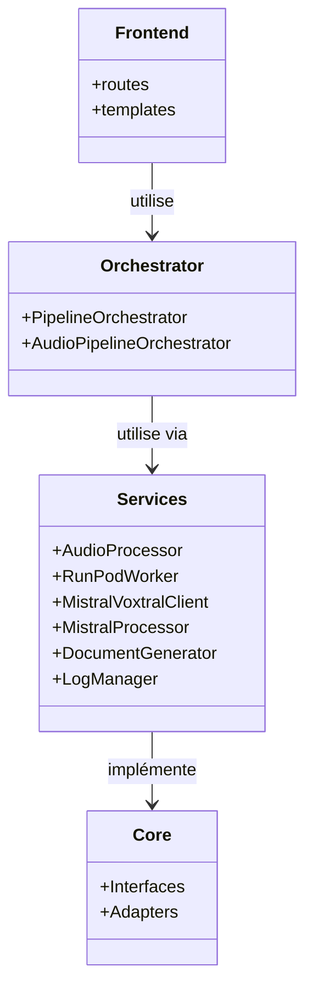

# Architecture de l'application Aodio

## Vue d'ensemble

L'application utilise une architecture hybride optimisée pour la performance et la simplicité :

```
┌─────────────┐
│   Railway   │  Flask App (Frontend + Orchestration)
│  (Serverless)│
└──────┬──────┘
       │
       ├─────────────────┐
       │                 │
       ▼                 ▼
┌─────────────┐   ┌──────────────┐
│   RunPod    │   │ Mistral AI   │
│  (GPU)      │   │   (API)      │
│             │   │              │
│ Pyannote    │   │ Voxtral      │
│ Diarisation │   │ Transcription│
└─────────────┘   └──────────────┘
       │                 │
       └────────┬────────┘
                │
                ▼
         ┌─────────────┐
         │  Mistral    │
         │   LLM       │
         │ (Mapping, CR, Décisions)
         └─────────────┘
```

## Composants

### 1. Railway (Flask Application)
- **Rôle** : Frontend web + Orchestration du pipeline
- **Technologies** : Flask, Tailwind CSS
- **Fonctions** :
  - Upload de fichiers audio et documents contextuels
  - Orchestration du pipeline de traitement
  - Génération de documents (TXT, DOCX, PDF)
  - Interface utilisateur

### 2. RunPod (Worker GPU)
- **Rôle** : Diarisation avec Pyannote
- **Pourquoi RunPod** : Pyannote nécessite un GPU et des modèles lourds
- **Configuration** : Voir `RUNPOD_SETUP.md`
- **Modèle** : `pyannote/speaker-diarization-3.1`

### 3. Mistral AI (API)
- **Rôle** : Transcription audio avec Voxtral
- **Pourquoi API directe** : Plus simple que de déployer vLLM sur RunPod
- **Modèle** : `voxtral-small-latest`
- **Avantages** :
  - Pas de gestion d'infrastructure GPU
  - Pas de configuration vLLM
  - Maintenance simplifiée
  - Scalabilité automatique

### 4. Mistral AI (LLM)
- **Rôle** : Traitement LLM (mapping speakers, pré-CR, décisions)
- **Modèles** : 
  - `mistral-small-latest` : Mapping des locuteurs
  - `mistral-large-latest` : Génération pré-CR et extraction décisions
- **Fonctions** :
  - Mapping des locuteurs (SPEAKER_XX → noms réels)
  - Génération du pré-compte rendu
  - Extraction des décisions

## Flux de traitement



### Détails du pipeline

1. **Upload** : L'utilisateur upload un fichier audio + documents contextuels (ordre du jour, liste des participants, relevés de votes)

2. **Traitement audio** : Normalisation et compression locale avec `pydub` et `librosa`
   - Conversion au format WAV 16kHz mono
   - Normalisation du volume
   - Réduction de bruit optionnelle

3. **Diarisation et Transcription en parallèle** :
   - **Diarisation** : Appel à RunPod pour identifier les locuteurs (Pyannote)
   - **Transcription** : Appel direct à l'API Mistral AI (Voxtral) pour transcription complète

4. **Alignement** : Fusion des résultats de diarisation et transcription
   - Alignement temporel précis des segments
   - Attribution des locuteurs à chaque segment de texte
   - Validation de la cohérence temporelle

5. **Mapping des locuteurs** : Identification des noms réels
   - Analyse Spacy pour identification rapide
   - Fallback Mistral Small pour les cas ambigus
   - Utilisation de la liste des participants si disponible

6. **Génération du pré-compte rendu** : Résumé structuré avec Mistral Large
   - Reformulation des débats
   - Organisation par points à l'ordre du jour
   - Attribution des idées aux bonnes personnes

7. **Extraction des décisions** : Identification des votes et décisions avec Mistral Large
   - Extraction factuelle des décisions
   - Formatage structuré

8. **Génération des documents** : Création des fichiers finaux
   - **Minutes** : Transcription verbatim avec mapping des locuteurs (TXT, DOCX, PDF)
   - **Pré-compte rendu** : Version condensée et reformulée (TXT, DOCX, PDF)
   - **Relevé des décisions** : Liste des décisions et votes (TXT, DOCX, PDF)

## Nouvelle architecture modulaire

Après le refactoring, l'application suit une architecture plus modulaire et maintenable :



### Avantages de la nouvelle architecture

1. **Séparation des préoccupations** :
   - `routes/` : Gestion des requêtes HTTP
   - `orchestrator/` : Logique d'orchestration
   - `services/` : Services métier
   - `core/` : Interfaces et adaptateurs

2. **Meilleure maintenabilité** :
   - Code plus modulaire et plus facile à tester
   - Responsabilités claires pour chaque composant
   - Facilité d'extension et de modification

3. **Testabilité améliorée** :
   - Possibilité de mock les services pour les tests
   - Tests unitaires plus faciles à écrire
   - Meilleure couverture de test

4. **Flexibilité** :
   - Possibilité de changer un service sans impacter les autres
   - Facilité d'ajout de nouveaux services
   - Meilleure gestion des dépendances

## Pourquoi cette architecture ?

### RunPod pour Pyannote uniquement
- Pyannote nécessite vraiment un GPU
- Modèles lourds (~500 MB)
- Nécessite PyTorch et dépendances CUDA

### API Mistral AI pour Voxtral
- **Plus simple** : Pas besoin de configurer vLLM
- **Moins cher** : Pay-per-use au lieu de GPU dédié
- **Plus rapide** : Pas de cold start GPU
- **Maintenance** : Géré par Mistral AI

### Alternative (si besoin)
Si vous préférez tout sur RunPod, vous pouvez :
1. Déployer vLLM sur RunPod
2. Modifier `app.py` pour utiliser `RunPodWorker.transcribe_audio()`
3. Mais cela ajoute de la complexité sans réel avantage

## Variables d'environnement requises

### Railway
- `SECRET_KEY` : Clé secrète Flask
- `MISTRAL_API_KEY` : Pour les appels LLM (Mistral Small/Large)
- `RUNPOD_API_KEY` : Pour Pyannote
- `RUNPOD_ENDPOINT_ID` : ID de l'endpoint RunPod
- `MISTRAL_API_KEY` : Pour Voxtral (obligatoire)

### RunPod Worker
- `HF_TOKEN` : Token Hugging Face pour Pyannote
- Configuration GPU (voir `RUNPOD_SETUP.md`)

## Coûts estimés

- **Railway** : ~$5-20/mois (selon usage)
- **RunPod** : ~$0.20-0.50/heure GPU (pay-per-use)
- **Mistral AI** : 
  - Transcription (Voxtral) : ~$0.01-0.05/minute audio
  - LLM (Mistral Small/Large) : ~$0.003-0.015/1k tokens

Pour une réunion de 1h :
- RunPod (diarisation) : ~$0.10-0.20
- Mistral AI (transcription) : ~$0.60-3.00
- Mistral AI (traitement LLM) : ~$0.50-2.00
- **Total** : ~$1.20-5.20 par réunion

