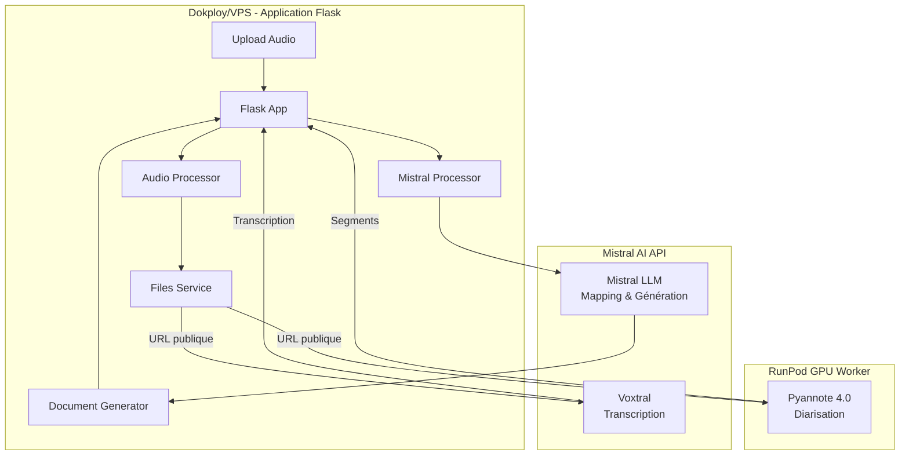

# Aodio

Application de transcription audio et génération de comptes rendus pour conseils universitaires. Transforme des enregistrements audio de réunions en documents structurés (minutes, pré-compte rendu, relevé des décisions) avec identification automatique des locuteurs.

## Fonctionnalités

- **Upload et traitement audio** : Normalisation, compression et amélioration de la qualité audio
- **Diarisation** : Identification automatique des locuteurs avec Pyannote 4.0 (via RunPod)
- **Transcription** : Transcription verbatim avec Voxtral (Mistral AI)
- **Identification des locuteurs** : Mapping des labels `SPEAKER_XX` vers les noms réels avec analyse comportementale et LLM
- **Génération de documents** : Création automatique de minutes, pré-compte rendu et relevé des décisions en formats TXT, DOCX et PDF
- **Historique** : Suivi de tous les traitements effectués
- **Interface web** : Interface Flask avec suivi en temps réel

## Architecture

L'application utilise une architecture hybride optimisée pour la performance et la simplicité :



### Composants principaux

1. **Flask Application** (Dokploy/Railway)
   - Interface web et orchestration du pipeline
   - Service de fichiers pour RunPod
   - Génération de documents finaux

2. **RunPod Worker** (GPU)
   - Diarisation avec Pyannote 4.0
   - Nécessite GPU (RTX 3090 ou A100 recommandé)

3. **Mistral AI** (API)
   - Transcription avec Voxtral
   - Mapping des locuteurs avec Mistral Small
   - Génération de pré-compte rendu et extraction de décisions avec Mistral Large

## Pipeline de traitement

Le pipeline suit cette séquence :

1. **Upload** : Fichier audio + documents contextuels (ordre du jour, liste participants, relevés de votes)
2. **Préprocessing audio** : Normalisation, réduction de bruit, conversion en WAV 16kHz mono
3. **Diarisation et Transcription (parallèle)** :
   - **Diarisation** : Pyannote identifie les segments de parole et attribue `SPEAKER_XX`
   - **Transcription** : Voxtral transcrit tout l'audio (stratégie Text-First)
4. **Alignement** : Fusion des segments de transcription avec la diarisation
5. **Mapping des locuteurs** : Identification des `SPEAKER_XX` avec analyse comportementale + LLM
6. **Traitement LLM** :
   - Génération du pré-compte rendu (Mistral Large)
   - Extraction des décisions et votes (Mistral Large)
7. **Génération de documents** : Création des fichiers finaux (TXT, DOCX, PDF)

## Installation locale

### Prérequis

- Python 3.9+
- FFmpeg (pour le traitement audio)
- Clés API :
  - Mistral AI (pour transcription et LLM)
  - RunPod (pour diarisation)
  - Hugging Face (pour accéder au modèle Pyannote)

### Installation

1. **Cloner le repository** :
```bash
git clone <repository-url>
cd aodio
```

2. **Créer un environnement virtuel** :
```bash
python -m venv venv
source venv/bin/activate  # Sur Windows: venv\Scripts\activate
```

3. **Installer les dépendances** :
```bash
pip install -r requirements.txt
```

**Note** : Le modèle Spacy français sera téléchargé automatiquement lors du premier usage.

4. **Configurer les variables d'environnement** :
```bash
cp env.example .env
# Éditer .env et ajouter vos clés API
```

5. **Lancer l'application** :
```bash
python app.py
```

L'application sera accessible sur `http://localhost:121` (ou le port défini dans PORT)

## Configuration

### Variables d'environnement

Créer un fichier `.env` avec les variables suivantes :

```env
# Clé secrète Flask (générer avec: python -c "import secrets; print(secrets.token_hex(32))")
SECRET_KEY=votre-secret-key-64-caracteres

# Configuration Flask
FLASK_DEBUG=False
ALLOWED_ORIGINS=https://votre-domaine.com

# Mistral AI (transcription + LLM)
MISTRAL_API_KEY=votre-cle-mistral

# RunPod (diarisation)
RUNPOD_API_KEY=votre-cle-runpod
RUNPOD_ENDPOINT_ID=votre-endpoint-id

# Configuration Dokploy (si déployé sur Dokploy)
DOKPLOY_ENV=true
DOKPLOY_PUBLIC_DOMAIN=https://votre-domaine.com
```

### Génération de SECRET_KEY

Générer une clé secrète sécurisée :
```bash
python3 -c "import secrets; print(secrets.token_hex(32))"
```

### Obtenir les clés API

#### Mistral AI

1. Créer un compte sur [https://console.mistral.ai/](https://console.mistral.ai/)
2. Aller dans "API Keys"
3. Créer une nouvelle clé API

#### RunPod

1. Créer un compte sur [https://www.runpod.io/](https://www.runpod.io/)
2. **API Key** : [https://www.runpod.io/console/user/settings](https://www.runpod.io/console/user/settings) → Section "API Keys"
3. **Endpoint ID** : Créer un endpoint (voir section Déploiement RunPod)

#### Hugging Face (pour RunPod)

1. Créer un compte sur [https://huggingface.co](https://huggingface.co)
2. Accepter les conditions d'utilisation Pyannote : [https://huggingface.co/pyannote/speaker-diarization-3.1](https://huggingface.co/pyannote/speaker-diarization-3.1)
3. Créer un token : [https://huggingface.co/settings/tokens](https://huggingface.co/settings/tokens) → Type "Read"

## Déploiement

### Déploiement sur Dokploy

1. **Prérequis** :
   - VPS avec Dokploy installé
   - Docker et Docker Compose

2. **Configuration** :
   - Ajouter toutes les variables d'environnement dans Dokploy
   - Configurer `DOKPLOY_ENV=true` et `DOKPLOY_PUBLIC_DOMAIN`

3. **Dockerfile** :
   - Le `Dockerfile` est déjà configuré
   - Port 121 exposé par défaut (configurable via variable PORT, Dokploy gère le reverse proxy)

4. **Volumes** :
   - Les dossiers `uploads/`, `processed/`, `logs/` sont créés automatiquement
   - Pour la persistance, configurer des volumes Docker dans Dokploy

5. **Vérification** :
```bash
curl https://votre-domaine.com/health
```

### Déploiement du Worker RunPod

1. **Créer un endpoint RunPod** :
   - Aller sur [https://www.runpod.io/console/serverless](https://www.runpod.io/console/serverless)
   - Cliquer sur "New Endpoint"
   - Choisir "Git"
   - Remplir :
     - **Repository URL** : URL de votre repo GitHub
     - **Branch** : `main`
     - **Dockerfile Path** : `runpod_worker/Dockerfile.runpod`
     - **Handler Path** : Laisser vide
     - **GPU Type** : RTX 3090 ou A100 (minimum 16 GB VRAM)
     - **Container Disk** : 20 GB

2. **Variables d'environnement RunPod** :
   - Ajouter `HF_TOKEN=votre-token-huggingface`

3. **Tester l'endpoint** :
   - Noter l'Endpoint ID généré
   - Vérifier que le worker démarre correctement
   - Consulter les logs pour confirmer le chargement de Pyannote

4. **Configuration Warm Workers** (recommandé) :
   - Dans les paramètres de l'endpoint, configurer 1 worker minimum
   - Évite le cold start (~2-3 minutes)

Pour plus de détails, voir `runpod_worker/README.md`

## API Endpoints

### Endpoints principaux

#### `POST /cancel/<session_id>` - Kill Switch (Annulation)
Annule un traitement en cours d'exécution. Utile pour arrêter un traitement qui dysfonctionne ou qui prend trop de temps.

**Méthode** : `POST`

**Paramètres** :
- `session_id` : ID de la session à annuler (dans l'URL)

**Réponse** :
```json
{
  "message": "Traitement annulé avec succès",
  "session_id": "abc123...",
  "runpod_job_cancelled": true
}
```

**Codes de statut** :
- `200` : Annulation réussie
- `400` : Traitement déjà terminé/annulé
- `404` : Session introuvable
- `500` : Erreur serveur

**Exemple d'utilisation** :
```bash
curl -X POST https://votre-domaine.com/cancel/abc123-def456-ghi789
```

**Comportement** :
1. Marque la session comme annulée dans le système
2. Tente d'annuler le job RunPod en cours (si disponible)
3. Le pipeline vérifie périodiquement l'état d'annulation et s'arrête proprement
4. Les ressources sont libérées progressivement

**Note** : L'annulation peut prendre quelques secondes à quelques dizaines de secondes selon l'étape en cours (diarisation, transcription, etc.).

### `POST /upload`

Upload d'un fichier audio et documents contextuels.

**Form Data** :
- `audio_file` : Fichier audio (WAV, MP3, M4A, FLAC, OGG, WEBM)
- `ordre_du_jour` : Fichier PDF/TXT (optionnel)
- `liste_participants` : Fichier TXT avec noms (un par ligne)
- `releves_votes` : Fichier PDF/TXT (optionnel)
- `president_seance` : Nom du président (texte)
- `date_seance` : Date de la séance (format YYYY-MM-DD)

**Réponse** :
```json
{
  "success": true,
  "session_id": "uuid",
  "message": "Fichiers uploadés avec succès. Traitement audio en cours..."
}
```

### `GET /status/<session_id>`

Récupère le statut du traitement d'une session.

**Réponse** :
```json
{
  "session_id": "uuid",
  "status": "processing",
  "stages": [
    {
      "stage": "diarization",
      "message": "Diarisation terminée",
      "timestamp": "2024-01-01T12:00:00"
    }
  ]
}
```

### `GET /download/<session_id>/<document_type>`

Télécharge un document généré.

**Types de documents** :
- `minutes_txt`, `minutes_docx`, `minutes_pdf`
- `pre_cr_txt`, `pre_cr_docx`, `pre_cr_pdf`
- `decisions_txt`, `decisions_docx`, `decisions_pdf`

### `GET /health`

Vérifie l'état de l'application et des services.

**Réponse** :
```json
{
  "status": "ok",
  "services": {
    "runpod_available": true,
    "mistral_available": true
  }
}
```

### `GET /files/<session_id>/<filename>`

Service interne pour servir les fichiers audio à RunPod (CORS activé).

## Documents générés

Pour chaque session, l'application génère 9 documents :

### Minutes (Transcription verbatim)
- Format : TXT, DOCX, PDF
- Contenu : Transcription complète avec timestamps et attribution des locuteurs

### Pré-compte rendu
- Format : TXT, DOCX, PDF
- Contenu : Synthèse structurée de la réunion générée par Mistral Large

### Relevé des décisions
- Format : TXT, DOCX, PDF
- Contenu : Liste des décisions actées et résultats des votes extraits par Mistral Large

## Dépannage

### Erreurs courantes

#### "RUNPOD_API_KEY n'est pas configurée"
- Vérifier que la variable est bien définie dans Dokploy
- Vérifier qu'il n'y a pas d'espaces avant/après
- Redémarrer l'application après modification

#### "Endpoint non trouvé (404)"
- Vérifier que `RUNPOD_ENDPOINT_ID` est correct
- Vérifier que l'endpoint existe dans RunPod
- Vérifier que l'endpoint est actif (pas en pause)

#### "Authentification échouée (401)" (RunPod)
- Vérifier que `RUNPOD_API_KEY` est correcte
- Vérifier que la clé n'a pas expiré
- Créer une nouvelle clé API si nécessaire

#### "Model not found" ou "401 Unauthorized" (RunPod)
- Vérifier que le token Hugging Face (`HF_TOKEN`) est correct
- Vérifier que vous avez accepté les conditions d'utilisation Pyannote
- Vérifier que le token a les permissions "Read"

#### "Out of memory" ou "CUDA out of memory"
- Utiliser un GPU avec plus de VRAM (minimum 16 GB recommandé)
- Réduire la taille des fichiers audio (normaliser avant l'envoi)

#### Le worker RunPod ne démarre pas
- Vérifier les logs dans RunPod (console → endpoint → Logs)
- Vérifier que `HF_TOKEN` est configuré dans l'endpoint
- Vérifier que vous avez des crédits RunPod disponibles

#### Transcription incomplète ou erronée
- Vérifier la qualité audio (normalisation activée par défaut)
- Vérifier que l'audio est en français (langue par défaut)
- Les fichiers très longs (>2h) peuvent prendre du temps

### Logs

Les logs sont disponibles dans :
- **Application** : `logs/app.log`
- **RunPod** : Console RunPod → Votre endpoint → Logs
- **Dokploy** : Interface Dokploy → Logs

### Vérification de la configuration

Tester l'endpoint de santé :
```bash
curl https://votre-domaine.com/health
```

Vérifier que tous les services sont disponibles :
```json
{
  "services": {
    "runpod_available": true,
    "mistral_available": true
  }
}
```

## Structure du projet

```
aodio/
├── app.py                 # Point d'entrée principal
├── config.py              # Configuration centralisée
├── wsgi.py                # Entry point WSGI pour Gunicorn
├── routes/
│   └── main_routes.py    # Routes Flask principales
├── services/
│   ├── audio_processor.py      # Traitement audio
│   ├── runpod_worker.py        # Client RunPod
│   ├── mistral_voxtral.py      # Client Mistral (transcription)
│   ├── mistral_processor.py    # Client Mistral (LLM)
│   ├── speaker_mapper.py       # Mapping des locuteurs
│   ├── document_generator.py   # Génération de documents
│   └── ...
├── orchestrator/
│   └── pipeline_orchestrator.py  # Orchestration du pipeline
├── runpod_worker/
│   ├── handler.py         # Handler RunPod (diarisation)
│   └── Dockerfile.runpod  # Dockerfile pour RunPod
├── templates/             # Templates HTML
├── static/                # Assets statiques
├── uploads/               # Fichiers uploadés
├── processed/             # Documents générés
└── logs/                  # Logs de l'application
```

## Technologies utilisées

- **Backend** : Flask 3.0, Gunicorn
- **Audio** : FFmpeg, PyDub, Librosa
- **Diarisation** : Pyannote 4.0 (via RunPod)
- **Transcription** : Mistral Voxtral
- **NLP** : Spacy (fr_core_news_md), FuzzyWuzzy
- **LLM** : Mistral AI (Small et Large)
- **Documents** : python-docx, ReportLab
- **Déploiement** : Docker, Dokploy, RunPod

## Limitations

- **Taille maximale** : 500 MB par fichier audio
- **Durée** : Pas de limite théorique, mais les fichiers très longs (>2h) peuvent être lents
- **Formats audio** : WAV, MP3, M4A, FLAC, OGG, WEBM
- **Langue** : Français (configurable dans le code)

## Coûts estimés

- **RunPod** : ~$0.29/heure (RTX 3090), ~$1.79/heure (A100)
- **Mistral AI** : Facturation à l'usage (transcription + LLM)
- **Temps moyen par réunion (1h)** : ~2-5 minutes de traitement
- **Coût par réunion** : ~$0.01-0.15 selon le GPU

## Support

Pour toute question ou problème :
- Vérifier les logs de l'application
- Consulter la section Dépannage
- Vérifier la configuration des services externes (RunPod, Mistral)

## Licence

[À compléter selon votre licence]
