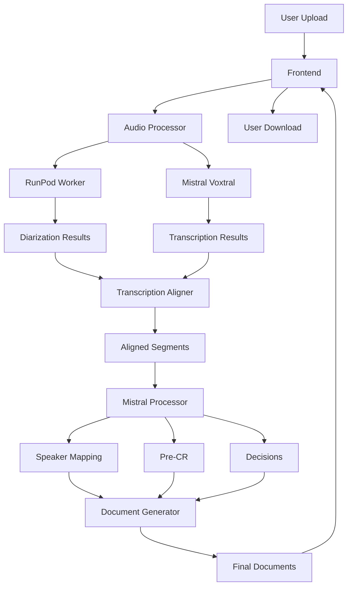

# Documentation des composants

## Structure globale

```
aodio/
├── app.py                     # Point d'entrée principal
├── core/                      # Interfaces et adaptateurs
│   ├── interfaces.py          # Interfaces des services
│   └── adapters.py            # Adaptateurs pour les services existants
├── orchestrator/              # Logique d'orchestration
│   └── pipeline_orchestrator.py # Orchestrateurs principaux
├── routes/                    # Routes Flask
│   └── main_routes.py         # Routes principales
├── services/                  # Services métier
│   ├── audio_processor.py     # Traitement audio
│   ├── runpod_worker.py       # Diarisation via RunPod
│   ├── mistral_voxtral.py     # Transcription via Mistral
│   ├── mistral_processor.py   # Traitement LLM via Mistral
│   ├── document_generator.py  # Génération de documents
│   └── log_manager.py         # Gestion des logs
└── tests/                     # Tests
```

## Composants détaillés

### 1. app.py

**Rôle** : Point d'entrée de l'application Flask

**Responsabilités** :
- Configuration initiale de l'application
- Chargement des variables d'environnement
- Configuration du logging
- Création de l'application Flask via `create_app()`

**Dépendances** :
- `routes/main_routes.py`

### 2. core/interfaces.py

**Rôle** : Définition des interfaces pour les services

**Interfaces définies** :
- `AudioProcessingService` : Traitement audio
- `DiarizationService` : Diarisation
- `TranscriptionService` : Transcription
- `LLMSpeakerMappingService` : Mapping des locuteurs
- `DocumentGenerationService` : Génération de documents
- `LogManagementService` : Gestion des logs

**Rôle** : Définir des contrats clairs pour chaque service

### 3. core/adapters.py

**Rôle** : Adaptateurs pour faire correspondre les services existants aux interfaces

**Adaptateurs** :
- `AudioProcessorAdapter`
- `RunPodWorkerAdapter`
- `MistralVoxtralClientAdapter`
- `MistralProcessorAdapter`
- `DocumentGeneratorAdapter`
- `LogManagerAdapter`

**Rôle** : Permettre l'utilisation des services existants avec les nouvelles interfaces

### 4. orchestrator/pipeline_orchestrator.py

**Rôle** : Orchestration du pipeline de traitement

**Classes** :
- `PipelineOrchestrator` : Orchestre le pipeline complet
- `AudioPipelineOrchestrator` : Orchestre le traitement audio

**Responsabilités** :
- Coordination des différents services
- Gestion du flux de traitement
- Gestion des erreurs
- Logging des étapes

**Dépendances** :
- Tous les services via les interfaces

### 5. routes/main_routes.py

**Rôle** : Gestion des routes Flask

**Routes** :
- `GET /` : Page d'accueil
- `GET /health` : Vérification de santé
- `GET /files/<session_id>/<filename>` : Service de fichiers
- `POST /upload` : Upload de fichiers
- `GET /status/<session_id>` : Statut du traitement
- `GET /download/<session_id>/<document_type>` : Téléchargement de documents
- `GET /history` : Historique des traitements
- `GET /confidentialite` : Page de confidentialité

**Responsabilités** :
- Gestion des requêtes HTTP
- Validation des entrées
- Appel des orchestrateurs
- Retour des réponses

**Dépendances** :
- `orchestrator/pipeline_orchestrator.py`
- `services/*`

### 6. services/audio_processor.py

**Rôle** : Traitement et normalisation des fichiers audio

**Fonctionnalités** :
- Conversion de format
- Normalisation du volume
- Réduction de bruit
- Découpage audio

**Méthodes principales** :
- `process_audio()` : Traitement complet
- `_process_with_ffmpeg_enhanced()` : Traitement amélioré
- `_process_with_ffmpeg_basic()` : Traitement basique

### 7. services/runpod_worker.py

**Rôle** : Interaction avec le worker RunPod pour la diarisation

**Fonctionnalités** :
- Upload de fichiers vers RunPod
- Appel à l'API RunPod
- Récupération des résultats de diarisation

**Méthodes principales** :
- `diarize_audio()` : Diarisation complète
- `_upload_file()` : Upload de fichier
- `_sanitize_payload()` : Nettoyage des données

### 8. services/mistral_voxtral.py

**Rôle** : Transcription audio via Mistral AI

**Fonctionnalités** :
- Transcription complète
- Découpage audio si nécessaire
- Alignement des segments
- Mapping des locuteurs

**Méthodes principales** :
- `transcribe_file_full()` : Transcription complète
- `transcribe_audio()` : Transcription avec diarisation
- `align_strict_improved()` : Alignement amélioré

### 9. services/mistral_processor.py

**Rôle** : Traitement LLM via Mistral AI

**Fonctionnalités** :
- Mapping des locuteurs
- Génération de pré-compte rendu
- Extraction des décisions

**Méthodes principales** :
- `map_speakers()` : Mapping des locuteurs
- `generate_pre_compte_rendu()` : Génération pré-CR
- `extract_decisions()` : Extraction des décisions

### 10. services/document_generator.py

**Rôle** : Génération des documents finaux

**Fonctionnalités** :
- Génération de minutes (verbatim)
- Génération de pré-compte rendu
- Génération de relevé des décisions
- Formats : TXT, DOCX, PDF

**Méthodes principales** :
- `generate_all_documents()` : Génération complète
- `_generate_minutes_*` : Génération des minutes
- `_generate_pre_cr_*` : Génération pré-CR
- `_generate_decisions_*` : Génération décisions

### 11. services/log_manager.py

**Rôle** : Gestion des logs et historique

**Fonctionnalités** :
- Enregistrement des statuts
- Récupération des statuts
- Gestion de l'historique
- Verrouillage des fichiers

**Méthodes principales** :
- `log_status()` : Enregistrement d'un statut
- `get_status()` : Récupération d'un statut
- `get_history()` : Récupération de l'historique

## Flux de données



## Responsabilités par couche

### Couche Frontend (routes/)
- Gestion des requêtes HTTP
- Validation des entrées
- Retour des réponses
- Gestion des erreurs HTTP

### Couche Orchestration (orchestrator/)
- Coordination des services
- Gestion du flux de traitement
- Gestion des erreurs métier
- Logging des étapes

### Couche Services (services/)
- Implémentation des fonctionnalités métier
- Appels aux APIs externes
- Traitement des données
- Génération des résultats

### Couche Core (core/)
- Définition des interfaces
- Adaptateurs pour les services
- Contrats clairs entre composants
- Abstraction des implémentations