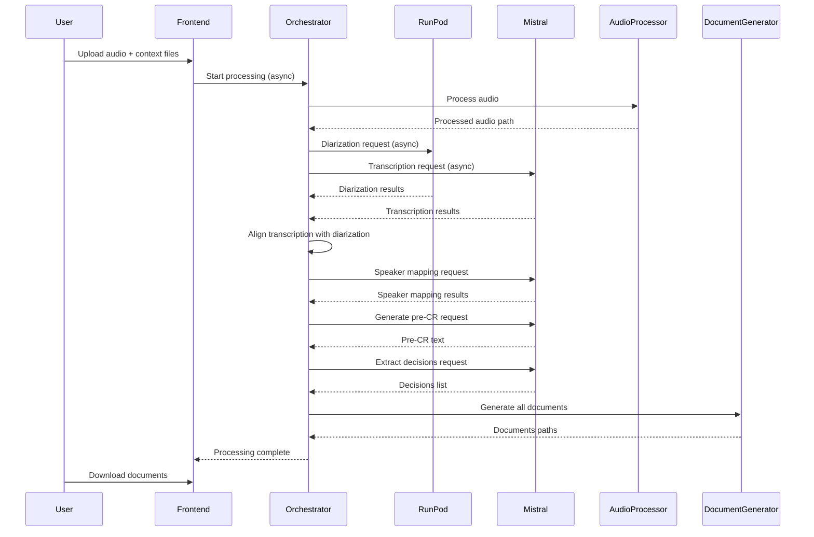
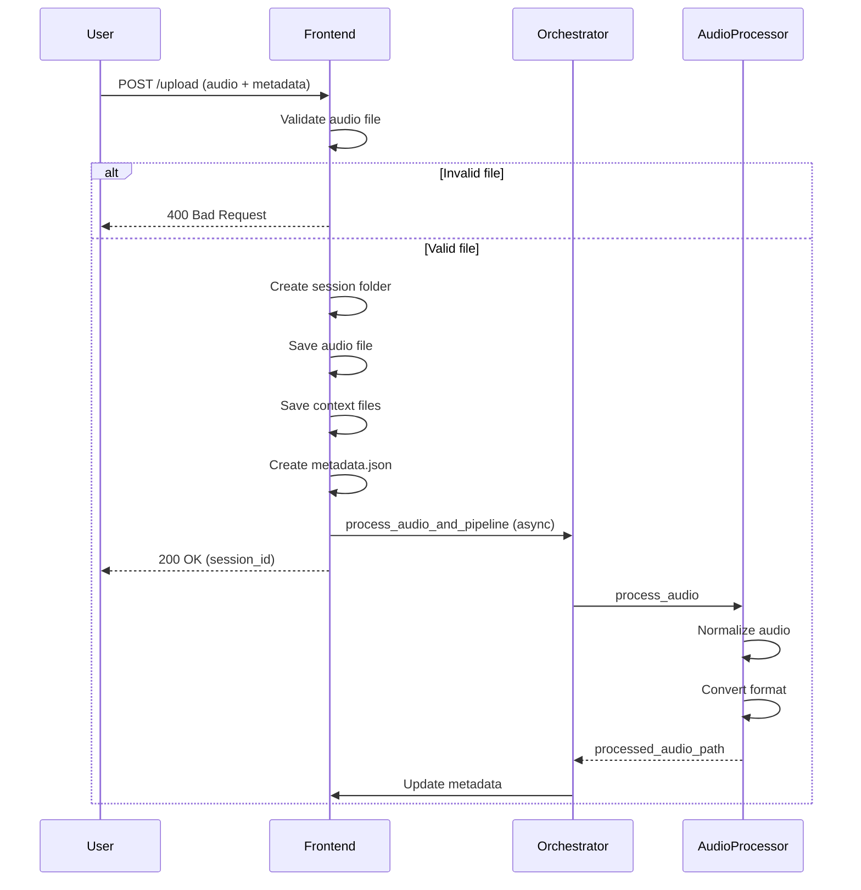
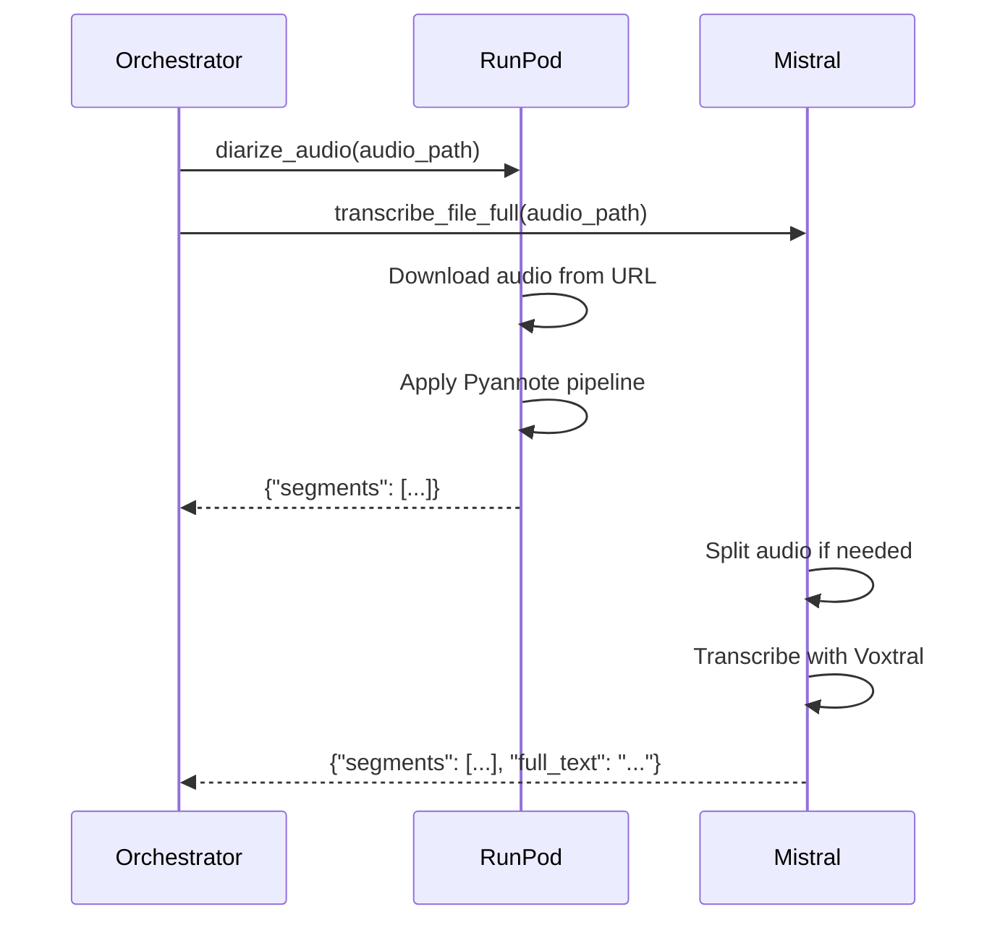
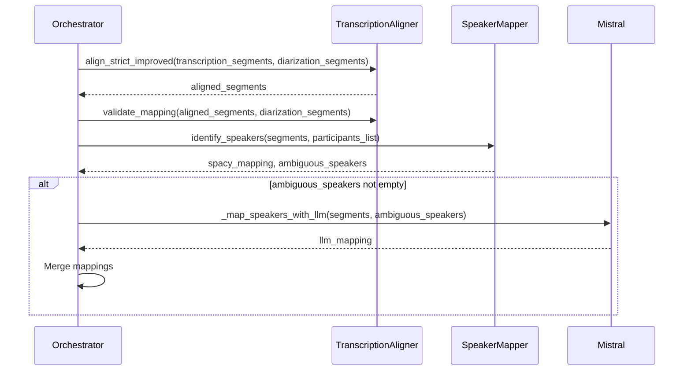
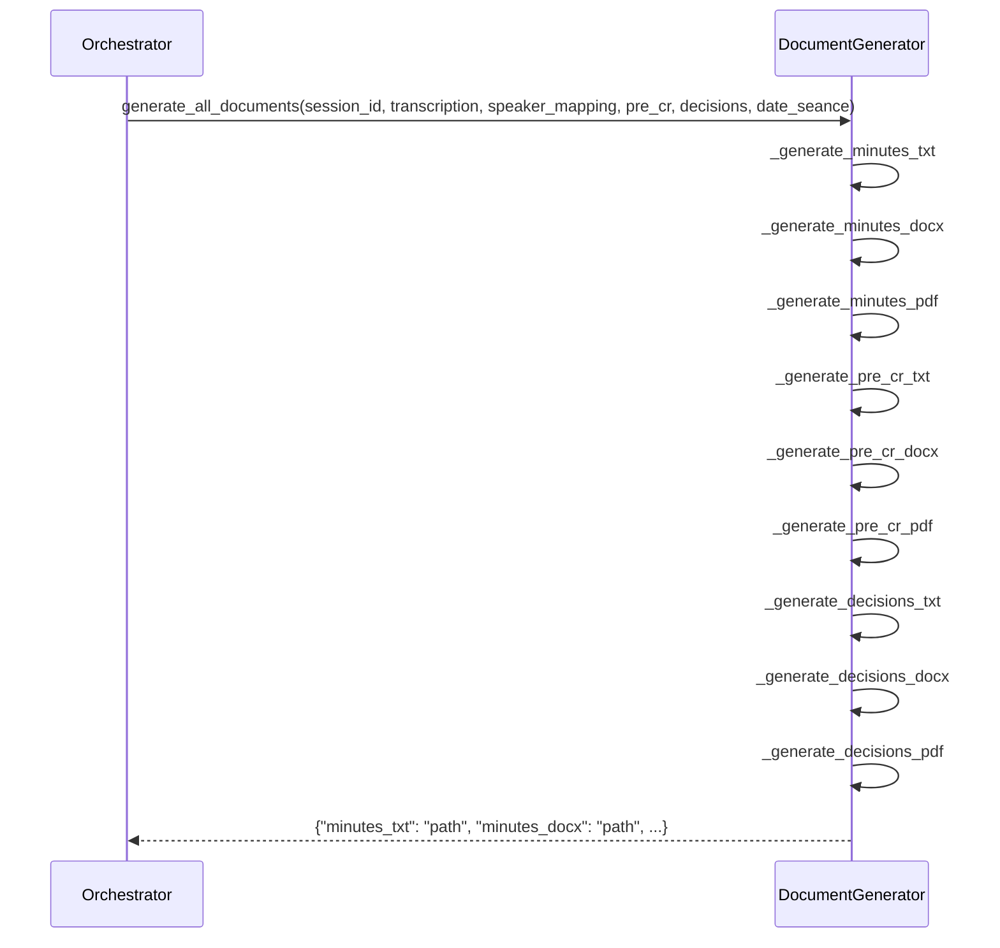
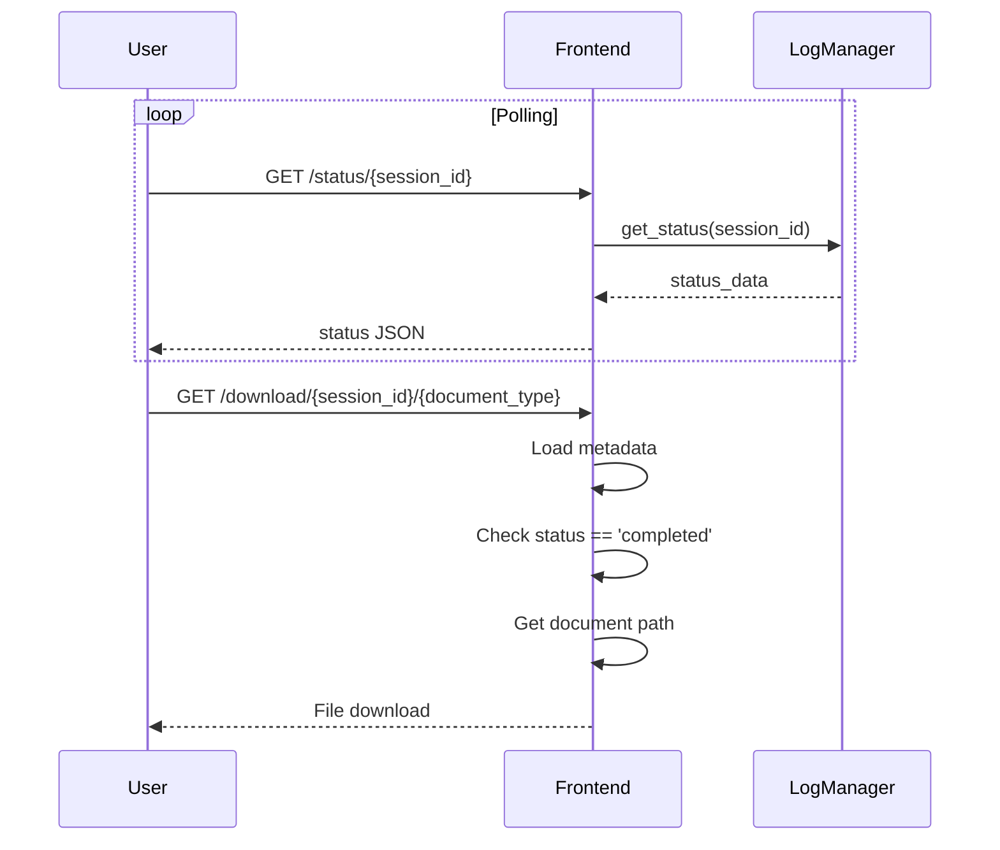

# Diagrammes de séquence

## Pipeline complet de traitement

## Upload et traitement initial

## Diarisation et transcription parallèle

## Alignement et mapping des locuteurs

## Génération des documents

## Récupération du statut et téléchargement

